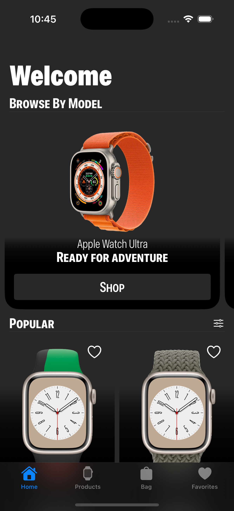
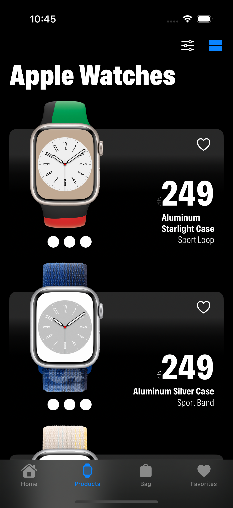
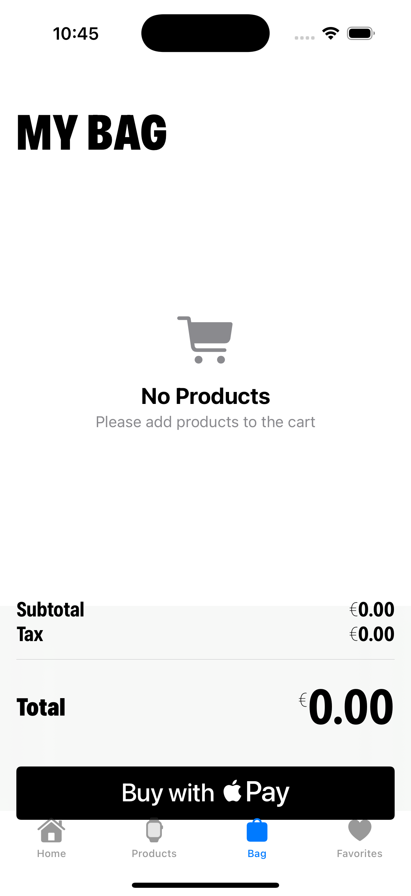
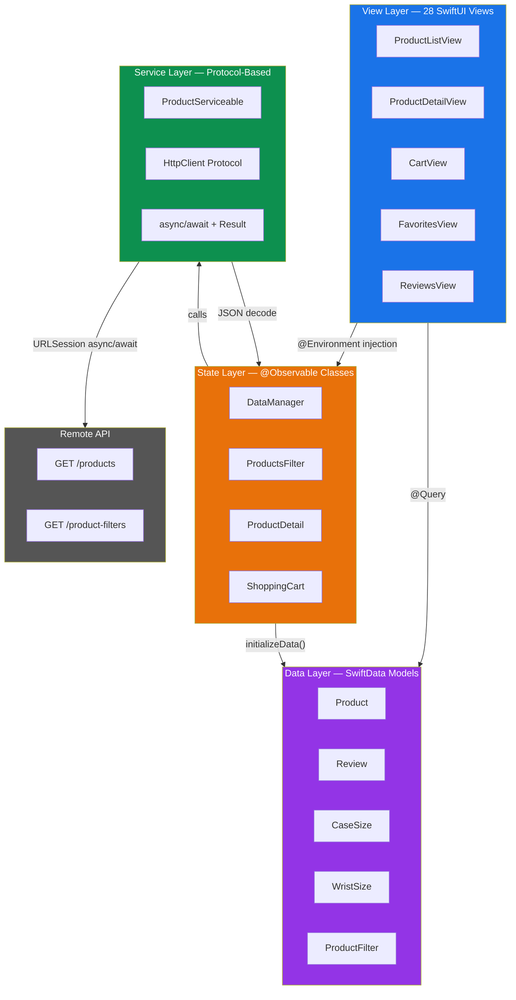
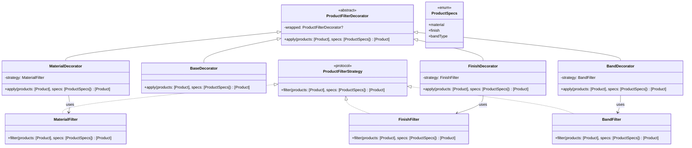
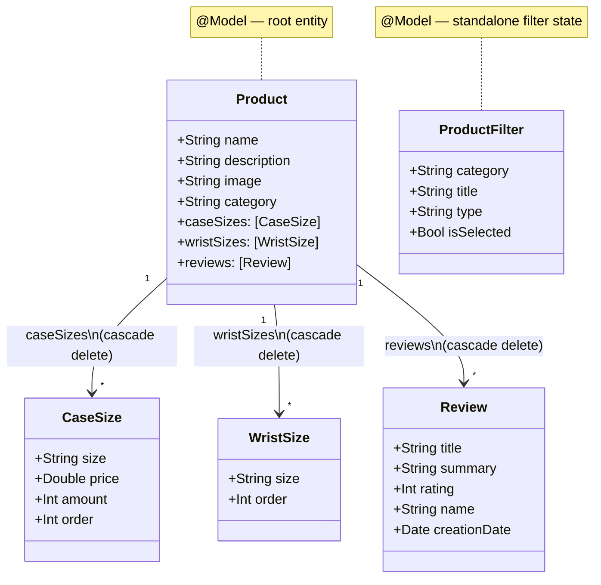

# Apple Watch Store

**A premium iOS e-commerce experience for browsing and purchasing Apple Watch products.**


Built entirely with Apple-native frameworks. Zero external dependencies. 69 Swift files of clean, pattern-driven architecture.

---

## Screenshots

<table>
  <tr>
    <td align="center" width="25%">
      <br>
      <sub><b>Home</b></sub>
    </td>
    <td align="center" width="25%">
      <br>
      <sub><b>Products</b></sub>
    </td>
    <td align="center" width="25%">
      <br>
      <sub><b>Shopping Cart</b></sub>
    </td>
  </tr>
</table>

---

## Features

| Feature | Description |
|---------|-------------|
| :mag: **Product Browsing** | List and grid layout toggle with smooth transitions |
| :gear: **Advanced Filtering** | Filter by material, finish, and band type using Decorator + Strategy patterns |
| :watch: **Product Details** | Case size, wrist size, and connectivity selectors |
| :shopping_cart: **Shopping Cart** | Quantity management with 19% GST tax calculation |
| :credit_card: **Apple Pay** | Full PassKit integration with billing contact support |
| :heart: **Favorites** | Wishlist functionality for saved products |
| :star: **Reviews** | Product reviews with star ratings |
| :bulb: **Onboarding Tips** | Guided user experience with TipKit |
| :globe_with_meridians: **11 Languages** | en, de, es, fr, ja, zh-Hans, pt-BR, ru, hi, bn, ar |
| :iphone: **Dynamic Type** | Full accessibility with ScaledFont and UIFontMetrics |

---

## Architecture

The app follows **MVVM with Observable State Management**, organized into four distinct layers.



### Data Flow

```
API  →  HttpClient.request()  →  Service  →  DataManager.initializeData()
  →  Map Codable structs to @Model  →  ModelContainer  →  @Query in Views
```

`@Observable` instances are passed into the SwiftUI environment via `@Environment`, providing reactive state management without Combine boilerplate.

---

## Design Patterns

### Decorator + Strategy Pattern Implementation



### All Patterns at a Glance

| Pattern | Where | Purpose |
|---------|-------|---------|
| **Decorator** | `ProductFilterDecorator` chain | Composable filter pipeline: Band -> Finish -> Material -> Base |
| **Strategy** | `ProductFilterStrategy` protocol | Interchangeable filtering algorithms per category |
| **Protocol-Based Services** | `ProductServiceable` | Decoupled service layer, testable via protocol conformance |
| **Enum-Driven Architecture** | `ProductSpecs` | Type-safe filter specifications with exhaustive switching |
| **Observable State** | `@Observable` + `@Environment` | Reactive state injection without Combine |
| **Endpoint Enum** | API endpoint definitions | Type-safe URL construction and request configuration |

---

## Class Diagram — SwiftData Models



---

## Tech Stack

| Framework | Purpose |
|-----------|---------|
| **SwiftUI** | Declarative UI with list/grid layouts, navigation, sheets |
| **SwiftData** | Persistent storage with `@Model`, `@Query`, `ModelContainer` |
| **Observation** | `@Observable` macro for reactive state management |
| **PassKit** | Apple Pay integration with payment sheet and billing contact |
| **TipKit** | Contextual user onboarding tips |
| **URLSession** | Async/await networking with `data(for:)` |
| **Foundation** | JSON decoding, localization, date formatting |
| **Combine** | Supporting reactive patterns where needed |

---

## Highlights

### Modern SwiftUI
- Declarative views with `@Query` for SwiftData integration
- `@Environment` injection for observable state
- List/grid toggle with smooth layout transitions

### Modern Swift
- `@Observable` macro replacing `ObservableObject` / `@Published`
- `@Model` macro for SwiftData persistence
- Generic protocol extensions with default implementations

### Structured Concurrency
- `async/await` throughout the networking layer
- `Task` blocks for bridging sync and async contexts
- `@MainActor` for UI-bound state mutations
- `Result<T, RequestError>` for typed error handling

### Localization
- 11 languages: English, German, Spanish, French, Japanese, Simplified Chinese, Brazilian Portuguese, Russian, Hindi, Bengali, Arabic
- `Localizable.strings` in dedicated `.lproj` directories

### Apple Pay
- Full PassKit integration with `PKPaymentAuthorizationViewController`
- Billing contact collection
- Merchant ID configuration
- Secure payment data handling (no card data touches the app)

### SwiftData Persistence
- `@Model` entities with relationship cascading
- `ModelContainer` configuration at app entry point
- `@Query` macro for reactive fetching in views

### Design Patterns
- Decorator chain for composable product filtering
- Strategy protocol for swappable filter algorithms
- Protocol-based service layer for testability
- Enum-driven type safety across filter specifications

---

## Requirements

| Requirement | Version |
|-------------|---------|
| **iOS** | 17.5+ |
| **Xcode** | 15.4+ |
| **Swift** | 5.9+ |

---

## License

This project is licensed under the **MIT License**. See [LICENSE](LICENSE) for details.

---

<p align="center">
  Built with SwiftUI and SwiftData
  <br>
  <strong>Zero dependencies. Pure Apple frameworks.</strong>
</p>
